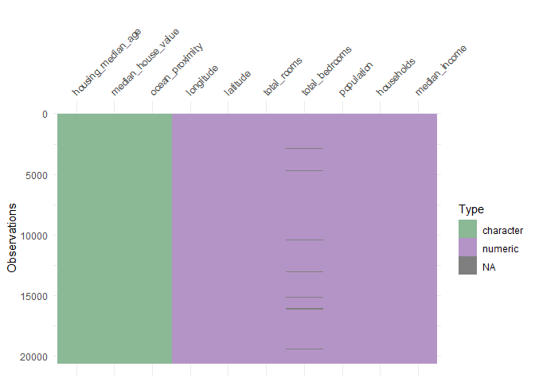
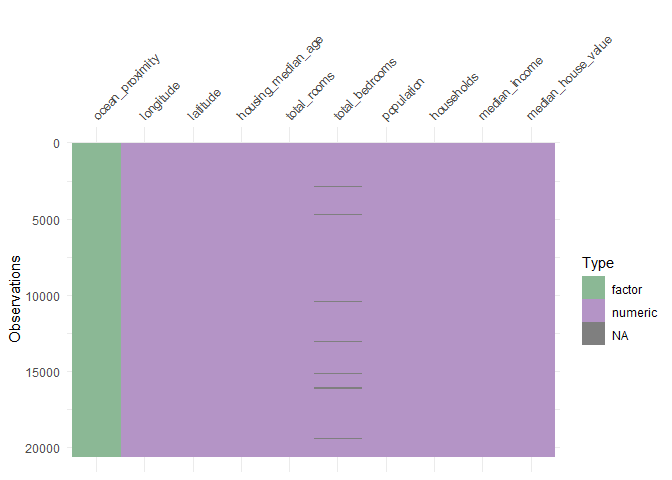
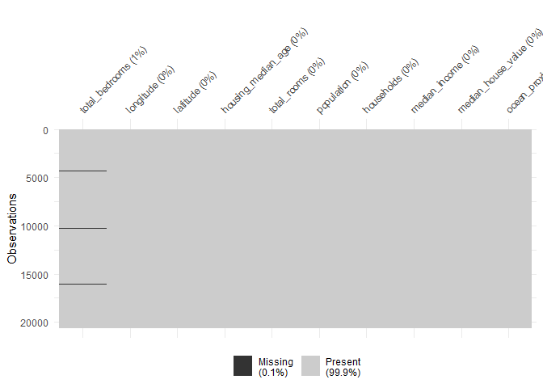
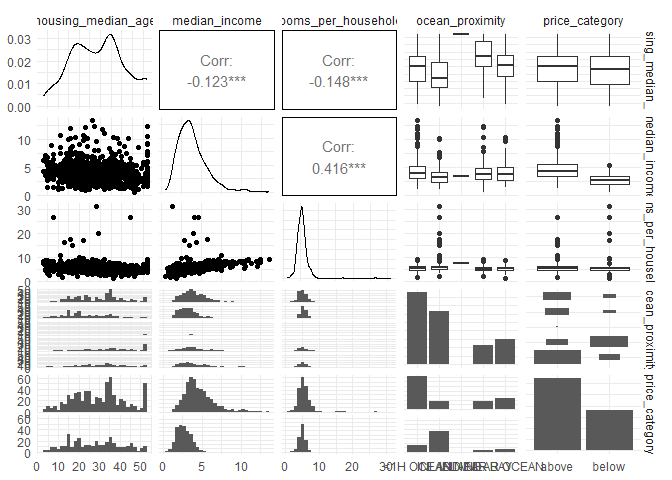
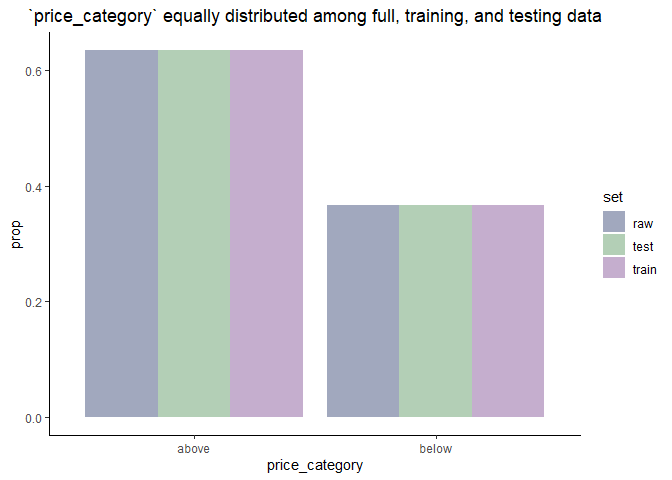

classification with tidymodels
================
chad allison \| 12 december 2022

------------------------------------------------------------------------

### loading required libraries and setting options

``` r
library(tidyverse) # essential functions
library(tidymodels) # essential for tidy modeling
library(visdat) # visualising data class structure
library(skimr) # data skimming
library(GGally) # pairwise plots

knitr::opts_chunk$set(message = F, warning = F)
options(scipen = 999)
theme_set(theme_minimal())
```

------------------------------------------------------------------------

### importing data

``` r
link = "https://raw.githubusercontent.com/kirenz/datasets/master/housing_unclean.csv"
housing_df = read_csv(link, col_types = cols())
rm(link)

head(housing_df)
```

    ## # A tibble: 6 x 10
    ##   longitude latitude housing_m~1 total~2 total~3 popul~4 house~5 media~6 media~7
    ##       <dbl>    <dbl> <chr>         <dbl>   <dbl>   <dbl>   <dbl>   <dbl> <chr>  
    ## 1     -122.     37.9 41.0years       880     129     322     126    8.33 452600~
    ## 2     -122.     37.9 21.0           7099    1106    2401    1138    8.30 358500~
    ## 3     -122.     37.8 52.0           1467     190     496     177    7.26 352100~
    ## 4     -122.     37.8 52.0           1274     235     558     219    5.64 341300~
    ## 5     -122.     37.8 52.0           1627     280     565     259    3.85 342200~
    ## 6     -122.     37.8 52.0            919     213     413     193    4.04 269700~
    ## # ... with 1 more variable: ocean_proximity <chr>, and abbreviated variable
    ## #   names 1: housing_median_age, 2: total_rooms, 3: total_bedrooms,
    ## #   4: population, 5: households, 6: median_income, 7: median_house_value

------------------------------------------------------------------------

### cleaning `housing_median_age` and `median_house_value`

``` r
housing_df = housing_df |>
  mutate(housing_median_age = str_remove_all(housing_median_age, "[years]"),
         median_house_value = str_remove_all(median_house_value, "[$]"))

housing_df |>
  select(housing_median_age, median_house_value) |>
  head()
```

    ## # A tibble: 6 x 2
    ##   housing_median_age median_house_value
    ##   <chr>              <chr>             
    ## 1 41.0               452600.0          
    ## 2 21.0               358500.0          
    ## 3 52.0               352100.0          
    ## 4 52.0               341300.0          
    ## 5 52.0               342200.0          
    ## 6 52.0               269700.0

------------------------------------------------------------------------

### viewing data structure

``` r
glimpse(housing_df)
```

    ## Rows: 20,640
    ## Columns: 10
    ## $ longitude          <dbl> -122.23, -122.22, -122.24, -122.25, -122.25, -122.2~
    ## $ latitude           <dbl> 37.88, 37.86, 37.85, 37.85, 37.85, 37.85, 37.84, 37~
    ## $ housing_median_age <chr> "41.0", "21.0", "52.0", "52.0", "52.0", "52.0", "52~
    ## $ total_rooms        <dbl> 880, 7099, 1467, 1274, 1627, 919, 2535, 3104, 2555,~
    ## $ total_bedrooms     <dbl> 129, 1106, 190, 235, 280, 213, 489, 687, 665, 707, ~
    ## $ population         <dbl> 322, 2401, 496, 558, 565, 413, 1094, 1157, 1206, 15~
    ## $ households         <dbl> 126, 1138, 177, 219, 259, 193, 514, 647, 595, 714, ~
    ## $ median_income      <dbl> 8.3252, 8.3014, 7.2574, 5.6431, 3.8462, 4.0368, 3.6~
    ## $ median_house_value <chr> "452600.0", "358500.0", "352100.0", "341300.0", "34~
    ## $ ocean_proximity    <chr> "NEAR BAY", "NEAR BAY", "NEAR BAY", "NEAR BAY", "NE~

------------------------------------------------------------------------

### visualising data structure

``` r
vis_dat(housing_df) +
  scale_fill_manual(values = c("#8BB895", "#B494C6"))
```

<!-- -->

------------------------------------------------------------------------

### exploring `ocean_proximity` variable

``` r
housing_df |>
  count(ocean_proximity,
        sort = T)
```

    ## # A tibble: 5 x 2
    ##   ocean_proximity     n
    ##   <chr>           <int>
    ## 1 <1H OCEAN        9136
    ## 2 INLAND           6551
    ## 3 NEAR OCEAN       2658
    ## 4 NEAR BAY         2290
    ## 5 ISLAND              5

------------------------------------------------------------------------

### reformatting variables

``` r
housing_df = housing_df |>
  mutate(housing_median_age = as.numeric(housing_median_age),
         median_house_value = as.numeric(median_house_value),
         across(where(is.character), as.factor))

vis_dat(housing_df) +
  scale_fill_manual(values = c("#8BB895", "#B494C6"))
```

<!-- -->

------------------------------------------------------------------------

### checking missing data

``` r
housing_df |>
  vis_miss(sort_miss = T)
```

<!-- -->

------------------------------------------------------------------------

### seeing exactly how many `NA` values we have

``` r
colSums(is.na(housing_df))
```

    ##          longitude           latitude housing_median_age        total_rooms 
    ##                  0                  0                  0                  0 
    ##     total_bedrooms         population         households      median_income 
    ##                207                  0                  0                  0 
    ## median_house_value    ocean_proximity 
    ##                  0                  0

------------------------------------------------------------------------

### creating new variables

``` r
housing_df = housing_df |>
  mutate(rooms_per_household = round(total_rooms / households, 4),
         bedrooms_per_room = round(total_bedrooms / total_rooms, 4),
         population_per_household = round(population / households), 4)

housing_df |>
  select(rooms_per_household, bedrooms_per_room, population_per_household) |>
  head()
```

    ## # A tibble: 6 x 3
    ##   rooms_per_household bedrooms_per_room population_per_household
    ##                 <dbl>             <dbl>                    <dbl>
    ## 1                6.98             0.147                        3
    ## 2                6.24             0.156                        2
    ## 3                8.29             0.130                        3
    ## 4                5.82             0.184                        3
    ## 5                6.28             0.172                        2
    ## 6                4.76             0.232                        2

------------------------------------------------------------------------

### creating dependent variable and dropping original numeric variable

``` r
housing_df = housing_df |>
  mutate(price_category = case_when(median_house_value < 150000 ~ "below",
                                    median_house_value >= 150000 ~ "above"),
         price_category = as.factor(price_category)) |>
  select(-median_house_value)

housing_df |>
  count(price_category) |>
  mutate(prop = round(n / sum(n), 3))
```

    ## # A tibble: 2 x 3
    ##   price_category     n  prop
    ##   <fct>          <int> <dbl>
    ## 1 above          13084 0.634
    ## 2 below           7556 0.366

------------------------------------------------------------------------

### data overview with `skimr`

``` r
skim(housing_df)
```

|                                                  |            |
|:-------------------------------------------------|:-----------|
| Name                                             | housing_df |
| Number of rows                                   | 20640      |
| Number of columns                                | 14         |
| \_\_\_\_\_\_\_\_\_\_\_\_\_\_\_\_\_\_\_\_\_\_\_   |            |
| Column type frequency:                           |            |
| factor                                           | 2          |
| numeric                                          | 12         |
| \_\_\_\_\_\_\_\_\_\_\_\_\_\_\_\_\_\_\_\_\_\_\_\_ |            |
| Group variables                                  | None       |

Data summary

**Variable type: factor**

| skim_variable   | n_missing | complete_rate | ordered | n_unique | top_counts                                  |
|:----------------|----------:|--------------:|:--------|---------:|:--------------------------------------------|
| ocean_proximity |         0 |             1 | FALSE   |        5 | \<1H: 9136, INL: 6551, NEA: 2658, NEA: 2290 |
| price_category  |         0 |             1 | FALSE   |        2 | abo: 13084, bel: 7556                       |

**Variable type: numeric**

| skim_variable            | n_missing | complete_rate |    mean |      sd |      p0 |     p25 |     p50 |     p75 |     p100 | hist  |
|:-------------------------|----------:|--------------:|--------:|--------:|--------:|--------:|--------:|--------:|---------:|:------|
| longitude                |         0 |          1.00 | -119.57 |    2.00 | -124.35 | -121.80 | -118.49 | -118.01 |  -114.31 | ▂▆▃▇▁ |
| latitude                 |         0 |          1.00 |   35.63 |    2.14 |   32.54 |   33.93 |   34.26 |   37.71 |    41.95 | ▇▁▅▂▁ |
| housing_median_age       |         0 |          1.00 |   28.64 |   12.59 |    1.00 |   18.00 |   29.00 |   37.00 |    52.00 | ▃▇▇▇▅ |
| total_rooms              |         0 |          1.00 | 2635.76 | 2181.62 |    2.00 | 1447.75 | 2127.00 | 3148.00 | 39320.00 | ▇▁▁▁▁ |
| total_bedrooms           |       207 |          0.99 |  537.87 |  421.39 |    1.00 |  296.00 |  435.00 |  647.00 |  6445.00 | ▇▁▁▁▁ |
| population               |         0 |          1.00 | 1425.48 | 1132.46 |    3.00 |  787.00 | 1166.00 | 1725.00 | 35682.00 | ▇▁▁▁▁ |
| households               |         0 |          1.00 |  499.54 |  382.33 |    1.00 |  280.00 |  409.00 |  605.00 |  6082.00 | ▇▁▁▁▁ |
| median_income            |         0 |          1.00 |    3.87 |    1.90 |    0.50 |    2.56 |    3.53 |    4.74 |    15.00 | ▇▇▁▁▁ |
| rooms_per_household      |         0 |          1.00 |    5.43 |    2.47 |    0.85 |    4.44 |    5.23 |    6.05 |   141.91 | ▇▁▁▁▁ |
| bedrooms_per_room        |       207 |          0.99 |    0.21 |    0.06 |    0.10 |    0.18 |    0.20 |    0.24 |     1.00 | ▇▁▁▁▁ |
| population_per_household |         0 |          1.00 |    3.08 |   10.39 |    1.00 |    2.00 |    3.00 |    3.00 |  1243.00 | ▇▁▁▁▁ |
| 4                        |         0 |          1.00 |    4.00 |    0.00 |    4.00 |    4.00 |    4.00 |    4.00 |     4.00 | ▁▁▇▁▁ |

### data overview with pariwise plots from `GGally`

``` r
housing_df |>
  sample_n(1000) |> # sampling for script run time
  select(housing_median_age, median_income, rooms_per_household,
         ocean_proximity, price_category) |>
  ggpairs()
```

<!-- -->

### data splitting

``` r
set.seed(123)
data_split = initial_split(housing_df, prop = 0.75, strata = price_category)
train_data = training(data_split)
test_data = testing(data_split)

raw_counts = housing_df |>
  count(price_category) |>
  mutate(prop = round(n / sum(n), 4),
         set = "raw")

train_counts = train_data |>
  count(price_category) |>
  mutate(prop = round(n / sum(n), 4),
         set = "train")

test_counts = test_data |>
  count(price_category) |>
  mutate(prop = round(n / sum(n), 4),
         set = "test")

rbind(raw_counts, train_counts, test_counts) |>
  ggplot(aes(price_category, prop)) +
  geom_col(aes(fill = set), position = "dodge", alpha = 0.75) +
  scale_fill_manual(values = c("#828BA8", "#99BF9E", "#B293BD")) +
  theme_classic() +
  labs(title = "`price_category` equally distributed among full, training, and testing data") +
  theme(plot.title = element_text(hjust = 0.5))
```

<!-- -->

``` r
rm(raw_counts, train_counts, test_counts)
```

------------------------------------------------------------------------

### break
