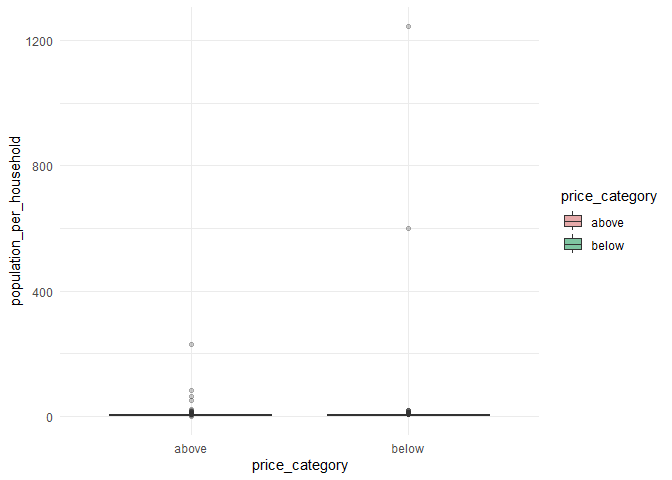
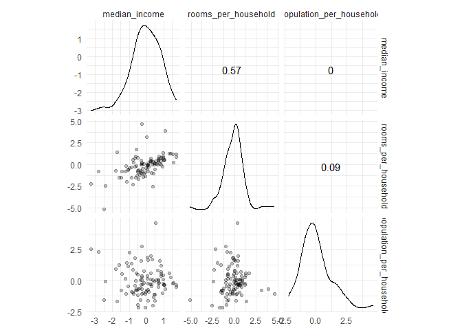

classification with tidymodels
================
chad allison \| 12 january 2023

------------------------------------------------------------------------

### contents

- [loading required libraries and setting
  options](#loading-required-libraries-and-setting-options)
- [importing data](#importing-data)
- [cleaning `housing_median_age` and
  `median_house_value`](#cleaning-housing_median_age-and-median_house_value)
- [viewing data structure](#viewing-data-structure)
- [visualising data structure](#visualising-data-structure)
- [exploring `ocean_proximity`
  variable](#exploring-ocean_proximity-variable)
- [reformatting variables](#reformatting-variables)
- [checking missing data](#checking-missing-data)
- [seeing exactly how many `NA` values we
  have](#seeing-exactly-how-many-na-values-we-have)
- [creating new variables](#creating-new-variables)
- [creating dependent variable and dropping original numeric
  variable](#creating-dependent-variable-and-dropping-original-numeric-variable)
- [data overview with `skimr`](#data-overview-with-skimr)
- [data overview with pairwise plots from
  `GGally`](#data-overview-with-pairwise-plots-from-ggally)
- [data splitting](#data-splitting)
- [geographical overview](#geographical-overview)
- [exploring numeric variables](#exploring-numeric-variables)
- [creating function to print
  boxplot](#creating-function-to-print-boxplot)
- [obtaining numeric y-variables](#obtaining-numeric-y-variables)
- [printing boxplots](#printing-boxplots)
- [re-creating function to filter some extreme
  cases](#re-creating-function-to-filter-some-extreme-cases)
- [using `ggscatmat` to create more pairwise
  plots](#using-ggscatmat-to-create-more-pairwise-plots)
- [exploring categorical variables](#exploring-categorical-variables)
- [creating heatmap](#creating-heatmap)
- [data preparation steps](#data-preparation-steps)
- [beginning data prep](#beginning-data-prep)
- [making new data split](#making-new-data-split)
- [creating preprocessing recipe](#creating-preprocessing-recipe)
- [checking out the prepped data](#checking-out-the-prepped-data)
- [visualising the numeric prepped
  data](#visualising-the-numeric-prepped-data)
- [cross-validation](#cross-validation)
- [specifying models](#specifying-models)
- [specifying logistic regression
  model](#specifying-logistic-regression-model)
- [specifying random forest model](#specifying-random-forest-model)
- [specifying boosted tree (XGBoost)
  model](#specifying-boosted-tree-xgboost-model)
- [specifying k-nearest neighbor
  model](#specifying-k-nearest-neighbor-model)
- [specifying neural network model](#specifying-neural-network-model)
- [creating logistic regression
  workflow](#creating-logistic-regression-workflow)
- [creating random forest workflow](#creating-random-forest-workflow)
- [creating XGBoost workflow](#creating-xgboost-workflow)
- [creating k-nearest neighbor
  workflow](#creating-k-nearest-neighbor-workflow)
- [creating neural network workflow](#creating-neural-network-workflow)
- [evaluating logistic regression](#evaluating-logistic-regression)
- [getting model coefficients](#getting-model-coefficients)
- [show all resample coefficients for a single
  predictor](#show-all-resample-coefficients-for-a-single-predictor)
- [show average performance over all
  folds](#show-average-performance-over-all-folds)
- [collecting predictions and printing confusion
  matrix](#collecting-predictions-and-printing-confusion-matrix)
- [visualising confusion matrix](#visualising-confusion-matrix)
- [ROC curve](#roc-curve)
- [probability distributions](#probability-distributions)
- [collecting random forest metrics](#collecting-random-forest-metrics)
- [collecting XGBoost metrics](#collecting-xgboost-metrics)
- [collecting k-nearest neighbors
  metrics](#collecting-k-nearest-neighbors-metrics)
- [collecting neural network
  metrics](#collecting-neural-network-metrics)
- [compare models](#compare-models)
- [change data format & visualise F1
  scores](#change-data-format-visualise-f1-scores)
- [visualising mean area under curve per
  model](#visualising-mean-area-under-curve-per-model)
- [getting best model (based on F1
  score)](#getting-best-model-based-on-f1-score)
- [last evaluation on test set](#last-evaluation-on-test-set)
- [seeing how metrics compare to training
  evaluation](#seeing-how-metrics-compare-to-training-evaluation)
- [variable importance scores](#variable-importance-scores)
- [final confusion matrix](#final-confusion-matrix)
- [final ROC curve](#final-roc-curve)
- [total script runtime](#total-script-runtime)

### loading required libraries and setting options

``` r
library(tidyverse) # essential functions
library(tidymodels) # essential for tidy modeling
library(visdat) # visualising data class structure
library(skimr) # data skimming
library(GGally) # pairwise plots
library(ggmap) # geographical visualisation
library(ranger) # random forest
library(keras) # neural network
library(vip) # variable importance

knitr::opts_chunk$set(message = F, warning = F)
options(scipen = 999)
theme_set(theme_minimal())

custom_red = "#FFCFCF"
custom_green = "#B7D1B3"
tictoc::tic()
```

------------------------------------------------------------------------

### importing data

``` r
link = "https://raw.githubusercontent.com/kirenz/datasets/master/housing_unclean.csv"
housing_df = read_csv(link, col_types = cols())
rm(link)

head(housing_df)
```

    ## # A tibble: 6 x 10
    ##   longitude latitude housing_m~1 total~2 total~3 popul~4 house~5 media~6 media~7
    ##       <dbl>    <dbl> <chr>         <dbl>   <dbl>   <dbl>   <dbl>   <dbl> <chr>  
    ## 1     -122.     37.9 41.0years       880     129     322     126    8.33 452600~
    ## 2     -122.     37.9 21.0           7099    1106    2401    1138    8.30 358500~
    ## 3     -122.     37.8 52.0           1467     190     496     177    7.26 352100~
    ## 4     -122.     37.8 52.0           1274     235     558     219    5.64 341300~
    ## 5     -122.     37.8 52.0           1627     280     565     259    3.85 342200~
    ## 6     -122.     37.8 52.0            919     213     413     193    4.04 269700~
    ## # ... with 1 more variable: ocean_proximity <chr>, and abbreviated variable
    ## #   names 1: housing_median_age, 2: total_rooms, 3: total_bedrooms,
    ## #   4: population, 5: households, 6: median_income, 7: median_house_value

------------------------------------------------------------------------

### cleaning `housing_median_age` and `median_house_value`

``` r
housing_df = housing_df |>
  mutate(housing_median_age = str_remove_all(housing_median_age, "[years]"),
         median_house_value = str_remove_all(median_house_value, "[$]"))

housing_df |>
  select(housing_median_age, median_house_value) |>
  head()
```

    ## # A tibble: 6 x 2
    ##   housing_median_age median_house_value
    ##   <chr>              <chr>             
    ## 1 41.0               452600.0          
    ## 2 21.0               358500.0          
    ## 3 52.0               352100.0          
    ## 4 52.0               341300.0          
    ## 5 52.0               342200.0          
    ## 6 52.0               269700.0

------------------------------------------------------------------------

### viewing data structure

``` r
glimpse(housing_df)
```

    ## Rows: 20,640
    ## Columns: 10
    ## $ longitude          <dbl> -122.23, -122.22, -122.24, -122.25, -122.25, -122.2~
    ## $ latitude           <dbl> 37.88, 37.86, 37.85, 37.85, 37.85, 37.85, 37.84, 37~
    ## $ housing_median_age <chr> "41.0", "21.0", "52.0", "52.0", "52.0", "52.0", "52~
    ## $ total_rooms        <dbl> 880, 7099, 1467, 1274, 1627, 919, 2535, 3104, 2555,~
    ## $ total_bedrooms     <dbl> 129, 1106, 190, 235, 280, 213, 489, 687, 665, 707, ~
    ## $ population         <dbl> 322, 2401, 496, 558, 565, 413, 1094, 1157, 1206, 15~
    ## $ households         <dbl> 126, 1138, 177, 219, 259, 193, 514, 647, 595, 714, ~
    ## $ median_income      <dbl> 8.3252, 8.3014, 7.2574, 5.6431, 3.8462, 4.0368, 3.6~
    ## $ median_house_value <chr> "452600.0", "358500.0", "352100.0", "341300.0", "34~
    ## $ ocean_proximity    <chr> "NEAR BAY", "NEAR BAY", "NEAR BAY", "NEAR BAY", "NE~

------------------------------------------------------------------------

### visualising data structure

``` r
vis_dat(housing_df) +
  scale_fill_manual(values = c("#8BB895", "#B494C6"))
```

<!-- -->

------------------------------------------------------------------------

### exploring `ocean_proximity` variable

``` r
housing_df |>
  count(ocean_proximity,
        sort = T)
```

    ## # A tibble: 5 x 2
    ##   ocean_proximity     n
    ##   <chr>           <int>
    ## 1 <1H OCEAN        9136
    ## 2 INLAND           6551
    ## 3 NEAR OCEAN       2658
    ## 4 NEAR BAY         2290
    ## 5 ISLAND              5

------------------------------------------------------------------------

### reformatting variables

``` r
housing_df = housing_df |>
  mutate(housing_median_age = as.numeric(housing_median_age),
         median_house_value = as.numeric(median_house_value),
         across(where(is.character), as.factor))

vis_dat(housing_df) +
  scale_fill_manual(values = c("#8BB895", "#B494C6"))
```

<!-- -->

------------------------------------------------------------------------

### checking missing data

``` r
housing_df |>
  vis_miss(sort_miss = T)
```

<!-- -->

------------------------------------------------------------------------

### seeing exactly how many `NA` values we have

``` r
colSums(is.na(housing_df))
```

    ##          longitude           latitude housing_median_age        total_rooms 
    ##                  0                  0                  0                  0 
    ##     total_bedrooms         population         households      median_income 
    ##                207                  0                  0                  0 
    ## median_house_value    ocean_proximity 
    ##                  0                  0

------------------------------------------------------------------------

### creating new variables

``` r
housing_df = housing_df |>
  mutate(rooms_per_household = round(total_rooms / households, 4),
         bedrooms_per_room = round(total_bedrooms / total_rooms, 4),
         population_per_household = round(population / households, 4))

housing_df |>
  select(rooms_per_household, bedrooms_per_room, population_per_household) |>
  head()
```

    ## # A tibble: 6 x 3
    ##   rooms_per_household bedrooms_per_room population_per_household
    ##                 <dbl>             <dbl>                    <dbl>
    ## 1                6.98             0.147                     2.56
    ## 2                6.24             0.156                     2.11
    ## 3                8.29             0.130                     2.80
    ## 4                5.82             0.184                     2.55
    ## 5                6.28             0.172                     2.18
    ## 6                4.76             0.232                     2.14

------------------------------------------------------------------------

### creating dependent variable and dropping original numeric variable

``` r
housing_df = housing_df |>
  mutate(price_category = case_when(median_house_value < 150000 ~ "below",
                                    median_house_value >= 150000 ~ "above"),
         price_category = as.factor(price_category)) |>
  select(-median_house_value)

housing_df |>
  count(price_category) |>
  mutate(prop = round(n / sum(n), 3))
```

    ## # A tibble: 2 x 3
    ##   price_category     n  prop
    ##   <fct>          <int> <dbl>
    ## 1 above          13084 0.634
    ## 2 below           7556 0.366

------------------------------------------------------------------------

### data overview with `skimr`

``` r
skim(housing_df)
```

|                                                  |            |
|:-------------------------------------------------|:-----------|
| Name                                             | housing_df |
| Number of rows                                   | 20640      |
| Number of columns                                | 13         |
| \_\_\_\_\_\_\_\_\_\_\_\_\_\_\_\_\_\_\_\_\_\_\_   |            |
| Column type frequency:                           |            |
| factor                                           | 2          |
| numeric                                          | 11         |
| \_\_\_\_\_\_\_\_\_\_\_\_\_\_\_\_\_\_\_\_\_\_\_\_ |            |
| Group variables                                  | None       |

Data summary

**Variable type: factor**

| skim_variable   | n_missing | complete_rate | ordered | n_unique | top_counts                                  |
|:----------------|----------:|--------------:|:--------|---------:|:--------------------------------------------|
| ocean_proximity |         0 |             1 | FALSE   |        5 | \<1H: 9136, INL: 6551, NEA: 2658, NEA: 2290 |
| price_category  |         0 |             1 | FALSE   |        2 | abo: 13084, bel: 7556                       |

**Variable type: numeric**

| skim_variable            | n_missing | complete_rate |    mean |      sd |      p0 |     p25 |     p50 |     p75 |     p100 | hist  |
|:-------------------------|----------:|--------------:|--------:|--------:|--------:|--------:|--------:|--------:|---------:|:------|
| longitude                |         0 |          1.00 | -119.57 |    2.00 | -124.35 | -121.80 | -118.49 | -118.01 |  -114.31 | ▂▆▃▇▁ |
| latitude                 |         0 |          1.00 |   35.63 |    2.14 |   32.54 |   33.93 |   34.26 |   37.71 |    41.95 | ▇▁▅▂▁ |
| housing_median_age       |         0 |          1.00 |   28.64 |   12.59 |    1.00 |   18.00 |   29.00 |   37.00 |    52.00 | ▃▇▇▇▅ |
| total_rooms              |         0 |          1.00 | 2635.76 | 2181.62 |    2.00 | 1447.75 | 2127.00 | 3148.00 | 39320.00 | ▇▁▁▁▁ |
| total_bedrooms           |       207 |          0.99 |  537.87 |  421.39 |    1.00 |  296.00 |  435.00 |  647.00 |  6445.00 | ▇▁▁▁▁ |
| population               |         0 |          1.00 | 1425.48 | 1132.46 |    3.00 |  787.00 | 1166.00 | 1725.00 | 35682.00 | ▇▁▁▁▁ |
| households               |         0 |          1.00 |  499.54 |  382.33 |    1.00 |  280.00 |  409.00 |  605.00 |  6082.00 | ▇▁▁▁▁ |
| median_income            |         0 |          1.00 |    3.87 |    1.90 |    0.50 |    2.56 |    3.53 |    4.74 |    15.00 | ▇▇▁▁▁ |
| rooms_per_household      |         0 |          1.00 |    5.43 |    2.47 |    0.85 |    4.44 |    5.23 |    6.05 |   141.91 | ▇▁▁▁▁ |
| bedrooms_per_room        |       207 |          0.99 |    0.21 |    0.06 |    0.10 |    0.18 |    0.20 |    0.24 |     1.00 | ▇▁▁▁▁ |
| population_per_household |         0 |          1.00 |    3.07 |   10.39 |    0.69 |    2.43 |    2.82 |    3.28 |  1243.33 | ▇▁▁▁▁ |

------------------------------------------------------------------------

### data overview with pairwise plots from `GGally`

``` r
housing_df |>
  sample_n(100) |> # sampling for script run time
  select(housing_median_age, median_income, rooms_per_household,
         ocean_proximity, price_category) |>
  ggpairs()
```

<!-- -->

------------------------------------------------------------------------

### data splitting

``` r
set.seed(123)
data_split = initial_split(housing_df, prop = 0.75, strata = price_category)
train_data = training(data_split)
test_data = testing(data_split)

raw_counts = housing_df |>
  count(price_category) |>
  mutate(prop = round(n / sum(n), 4),
         set = "raw")

train_counts = train_data |>
  count(price_category) |>
  mutate(prop = round(n / sum(n), 4),
         set = "train")

test_counts = test_data |>
  count(price_category) |>
  mutate(prop = round(n / sum(n), 4),
         set = "test")

rbind(raw_counts, train_counts, test_counts) |>
  ggplot(aes(price_category, prop)) +
  geom_col(aes(fill = set), position = "dodge", alpha = 0.75) +
  scale_fill_manual(values = c("#828BA8", "#99BF9E", "#B293BD")) +
  theme_classic() +
  labs(title = "`price_category` equally distributed among full, training, and testing data") +
  theme(plot.title = element_text(hjust = 0.5))
```

<!-- -->

``` r
rm(raw_counts, train_counts, test_counts)
```

------------------------------------------------------------------------

### geographical overview

``` r
data_explore = train_data # so we don't alter our data

qmplot(x = longitude, y = latitude, data = data_explore,
       geom = "point", col = price_category, size = population, alpha = 0.25) +
  scale_alpha(guide = "none") +
  scale_color_manual(values = c("indianred3", "lightsteelblue3"))
```

<!-- -->

------------------------------------------------------------------------

### exploring numeric variables

``` r
data_explore |>
  ggplot(aes(price_category, median_income)) +
  geom_boxplot(aes(fill = price_category),
               outlier.alpha = 0.25, alpha = 0.5) +
  scale_fill_manual(values = c("indianred3", "springgreen4"))
```

<!-- -->

------------------------------------------------------------------------

### creating function to print boxplot

``` r
print_boxplot = function(.y_var) {
  y_var = sym(.y_var)
  
  data_explore |>
    ggplot(aes(price_category, {{y_var}})) +
    geom_boxplot(aes(fill = price_category), outlier.alpha = 0.25, alpha = 0.5) +
    scale_fill_manual(values = c("indianred3", "springgreen4"))
}
```

------------------------------------------------------------------------

### obtaining numeric y-variables

``` r
y_var = data_explore |>
  select(where(is.numeric), -longitude, -latitude) |>
  variable.names()
```

------------------------------------------------------------------------

### printing boxplots

``` r
map(y_var, print_boxplot)
```

    ## [[1]]

<!-- -->

    ## 
    ## [[2]]

<!-- -->

    ## 
    ## [[3]]

<!-- -->

    ## 
    ## [[4]]

<!-- -->

    ## 
    ## [[5]]

<!-- -->

    ## 
    ## [[6]]

<!-- -->

    ## 
    ## [[7]]

<!-- -->

    ## 
    ## [[8]]

<!-- -->

    ## 
    ## [[9]]

<!-- -->

------------------------------------------------------------------------

### re-creating function to filter some extreme cases

``` r
print_boxplot_out = function(.y_var_out) {
  y_var = sym(.y_var_out)
  
  data_explore |>
    filter(rooms_per_household < 50, population_per_household < 20) |>
    ggplot(aes(price_category, {{y_var}})) +
    geom_boxplot(aes(fill = price_category), alpha = 0.5, outlier.alpha = 0.25) +
    scale_fill_manual(values = c("indianred3", "springgreen4"))
}

y_var_out = data_explore |>
  select(rooms_per_household, population_per_household) |>
  variable.names()

map(y_var_out, print_boxplot_out)
```

    ## [[1]]

<!-- -->

    ## 
    ## [[2]]

<!-- -->

------------------------------------------------------------------------

### using `ggscatmat` to create more pairwise plots

``` r
data_explore |>
  sample_n(100) |> # speed
  select(price_category, median_income, bedrooms_per_room,
         rooms_per_household, population_per_household) |>
  ggscatmat(color = "price_category", corMethod = "spearman", alpha = 0.25) +
  scale_color_manual(values = c("indianred3", "springgreen4"))
```

<!-- -->

------------------------------------------------------------------------

### exploring categorical variables

``` r
data_explore |>
  filter(ocean_proximity != "ISLAND") |>
  count(price_category, ocean_proximity) |>
  group_by(price_category) |>
  mutate(percent = n / sum(n) * 100,
         percent = round(percent, 2),
         percent = paste0(percent, "%")) |>
  ggplot(aes(ocean_proximity, n)) +
  geom_col(aes(fill = price_category), position = "dodge") +
  geom_text(aes(label = percent), position = position_dodge2(width = 0.9), vjust = -0.5, size = 3.25) +
  scale_fill_manual(values = c(custom_red, custom_green)) # this step is where i added these as variables
```

<!-- -->

------------------------------------------------------------------------

### creating heatmap

``` r
data_explore |>
  ggplot(aes(price_category, ocean_proximity)) +
  geom_bin2d() +
  stat_bin2d(geom = "text", aes(label = ..count..)) +
  scale_fill_continuous(type = "viridis")
```

<!-- -->

------------------------------------------------------------------------

### data preparation steps

- handle missing values
- fix or remove outliers
- feature selection
- feature engineering
- feature scaling
- create a validation set

------------------------------------------------------------------------

### beginning data prep

``` r
housing_df_new = housing_df |>
  select(longitude, latitude,
         price_category, median_income, ocean_proximity,
         bedrooms_per_room, rooms_per_household, population_per_household)

glimpse(housing_df_new)
```

    ## Rows: 20,640
    ## Columns: 8
    ## $ longitude                <dbl> -122.23, -122.22, -122.24, -122.25, -122.25, ~
    ## $ latitude                 <dbl> 37.88, 37.86, 37.85, 37.85, 37.85, 37.85, 37.~
    ## $ price_category           <fct> above, above, above, above, above, above, abo~
    ## $ median_income            <dbl> 8.3252, 8.3014, 7.2574, 5.6431, 3.8462, 4.036~
    ## $ ocean_proximity          <fct> NEAR BAY, NEAR BAY, NEAR BAY, NEAR BAY, NEAR ~
    ## $ bedrooms_per_room        <dbl> 0.1466, 0.1558, 0.1295, 0.1845, 0.1721, 0.231~
    ## $ rooms_per_household      <dbl> 6.9841, 6.2381, 8.2881, 5.8174, 6.2819, 4.761~
    ## $ population_per_household <dbl> 2.5556, 2.1098, 2.8023, 2.5479, 2.1815, 2.139~

------------------------------------------------------------------------

### making new data split

``` r
set.seed(123)
data_split = initial_split(housing_df_new, prop = 3 / 4, strata = price_category)
train_data = training(data_split)
test_data = testing(data_split)

paste0("training data: ", nrow(train_data), " observations")
```

    ## [1] "training data: 15480 observations"

``` r
paste0("testing data: ", nrow(test_data), " observations")
```

    ## [1] "testing data: 5160 observations"

------------------------------------------------------------------------

### creating preprocessing recipe

``` r
housing_rec = recipe(price_category ~ ., data = train_data) |>
  update_role(longitude, latitude, new_role = "ID") |>
  # log transforms our skewed data
  step_log(median_income, bedrooms_per_room, rooms_per_household, population_per_household) |>
  # removes any NAs
  step_naomit(everything(), skip = T) |>
  # converts nominal variables to factors
  step_novel(all_nominal(), -all_outcomes()) |>
  # normalizes numeric variables, z-standardization
  step_normalize(all_numeric(), - all_outcomes(),
                 -longitude, -latitude) |>
  # converts `ocean_proximity` to numeric binary
  step_dummy(all_nominal(), -all_outcomes()) |>
  # removes numeric variables with zero variance
  step_zv(all_numeric(), -all_outcomes()) |>
  # removes predictor variables that are highly correlated with other predictor variables
  step_corr(all_predictors(), threshold = 0.7, method = "spearman")

summary(housing_rec)
```

    ## # A tibble: 8 x 4
    ##   variable                 type      role      source  
    ##   <chr>                    <list>    <chr>     <chr>   
    ## 1 longitude                <chr [2]> ID        original
    ## 2 latitude                 <chr [2]> ID        original
    ## 3 median_income            <chr [2]> predictor original
    ## 4 ocean_proximity          <chr [3]> predictor original
    ## 5 bedrooms_per_room        <chr [2]> predictor original
    ## 6 rooms_per_household      <chr [2]> predictor original
    ## 7 population_per_household <chr [2]> predictor original
    ## 8 price_category           <chr [3]> outcome   original

------------------------------------------------------------------------

### checking out the prepped data

``` r
prepped_data = housing_rec |>
  prep() |>
  juice()

glimpse(prepped_data)
```

    ## Rows: 15,325
    ## Columns: 10
    ## $ longitude                  <dbl> -122.23, -122.22, -122.24, -122.25, -122.25~
    ## $ latitude                   <dbl> 37.88, 37.86, 37.85, 37.85, 37.85, 37.84, 3~
    ## $ median_income              <dbl> 1.84205233775, 1.83600625624, 1.55216359856~
    ## $ rooms_per_household        <dbl> 1.06763882, 0.65677817, 1.69027265, 0.68222~
    ## $ population_per_household   <dbl> -0.3912991, -1.0997473, -0.0507250, -0.9762~
    ## $ price_category             <fct> above, above, above, above, above, above, a~
    ## $ ocean_proximity_INLAND     <dbl> 0, 0, 0, 0, 0, 0, 0, 0, 0, 0, 0, 0, 0, 0, 0~
    ## $ ocean_proximity_ISLAND     <dbl> 0, 0, 0, 0, 0, 0, 0, 0, 0, 0, 0, 0, 0, 0, 0~
    ## $ ocean_proximity_NEAR.BAY   <dbl> 1, 1, 1, 1, 1, 1, 1, 1, 1, 1, 1, 1, 1, 1, 1~
    ## $ ocean_proximity_NEAR.OCEAN <dbl> 0, 0, 0, 0, 0, 0, 0, 0, 0, 0, 0, 0, 0, 0, 0~

------------------------------------------------------------------------

### visualising the numeric prepped data

``` r
prepped_data |>
  sample_n(100) |> # speed
  select(price_category, median_income, rooms_per_household, population_per_household) |>
  ggscatmat(corMethod = "spearman", alpha = 0.25)
```

<!-- -->

------------------------------------------------------------------------

### cross-validation

``` r
set.seed(100)
cv_folds = vfold_cv(train_data, v = 5, strata = price_category)
# will come back to this after specifying models
```

------------------------------------------------------------------------

### specifying models

1.  pick a `model type`
2.  set the `engine`
3.  set the `mode` (regression or classification)

------------------------------------------------------------------------

### specifying logistic regression model

``` r
log_spec = logistic_reg() |> # model type
  set_engine(engine = "glm") |> # model engine
  set_mode("classification") # model mode

log_spec
```

    ## Logistic Regression Model Specification (classification)
    ## 
    ## Computational engine: glm

------------------------------------------------------------------------

### specifying random forest model

``` r
rf_spec = rand_forest() |>
  set_engine("ranger", importance = "impurity") |>
  set_mode("classification")

rf_spec
```

    ## Random Forest Model Specification (classification)
    ## 
    ## Engine-Specific Arguments:
    ##   importance = impurity
    ## 
    ## Computational engine: ranger

------------------------------------------------------------------------

### specifying boosted tree (XGBoost) model

``` r
xgb_spec = boost_tree() |>
  set_engine("xgboost") |>
  set_mode("classification")

xgb_spec
```

    ## Boosted Tree Model Specification (classification)
    ## 
    ## Computational engine: xgboost

------------------------------------------------------------------------

### specifying k-nearest neighbor model

``` r
knn_spec = nearest_neighbor(neighbors = 4) |> # note that the number of neighbors can be specified
  set_engine("kknn") |>
  set_mode("classification")

knn_spec
```

    ## K-Nearest Neighbor Model Specification (classification)
    ## 
    ## Main Arguments:
    ##   neighbors = 4
    ## 
    ## Computational engine: kknn

------------------------------------------------------------------------

### specifying neural network model

``` r
nnet_spec = mlp() |>
  set_mode("classification") |>
  set_engine("keras", verbose = 0)

nnet_spec
```

    ## Single Layer Neural Network Specification (classification)
    ## 
    ## Engine-Specific Arguments:
    ##   verbose = 0
    ## 
    ## Computational engine: keras

------------------------------------------------------------------------

### creating logistic regression workflow

``` r
log_wflow = workflow() |>
  add_recipe(housing_rec) |>
  add_model(log_spec)

log_wflow
```

    ## == Workflow ====================================================================
    ## Preprocessor: Recipe
    ## Model: logistic_reg()
    ## 
    ## -- Preprocessor ----------------------------------------------------------------
    ## 7 Recipe Steps
    ## 
    ## * step_log()
    ## * step_naomit()
    ## * step_novel()
    ## * step_normalize()
    ## * step_dummy()
    ## * step_zv()
    ## * step_corr()
    ## 
    ## -- Model -----------------------------------------------------------------------
    ## Logistic Regression Model Specification (classification)
    ## 
    ## Computational engine: glm

------------------------------------------------------------------------

### creating random forest workflow

``` r
rf_wflow = workflow() |>
  add_recipe(housing_rec) |>
  add_model(rf_spec)

rf_wflow
```

    ## == Workflow ====================================================================
    ## Preprocessor: Recipe
    ## Model: rand_forest()
    ## 
    ## -- Preprocessor ----------------------------------------------------------------
    ## 7 Recipe Steps
    ## 
    ## * step_log()
    ## * step_naomit()
    ## * step_novel()
    ## * step_normalize()
    ## * step_dummy()
    ## * step_zv()
    ## * step_corr()
    ## 
    ## -- Model -----------------------------------------------------------------------
    ## Random Forest Model Specification (classification)
    ## 
    ## Engine-Specific Arguments:
    ##   importance = impurity
    ## 
    ## Computational engine: ranger

------------------------------------------------------------------------

### creating XGBoost workflow

``` r
xgb_wflow = workflow() |>
  add_recipe(housing_rec) |>
  add_model(xgb_spec)

xgb_wflow
```

    ## == Workflow ====================================================================
    ## Preprocessor: Recipe
    ## Model: boost_tree()
    ## 
    ## -- Preprocessor ----------------------------------------------------------------
    ## 7 Recipe Steps
    ## 
    ## * step_log()
    ## * step_naomit()
    ## * step_novel()
    ## * step_normalize()
    ## * step_dummy()
    ## * step_zv()
    ## * step_corr()
    ## 
    ## -- Model -----------------------------------------------------------------------
    ## Boosted Tree Model Specification (classification)
    ## 
    ## Computational engine: xgboost

------------------------------------------------------------------------

### creating k-nearest neighbor workflow

``` r
knn_wflow = workflow() |>
  add_recipe(housing_rec) |>
  add_model(knn_spec)

knn_wflow
```

    ## == Workflow ====================================================================
    ## Preprocessor: Recipe
    ## Model: nearest_neighbor()
    ## 
    ## -- Preprocessor ----------------------------------------------------------------
    ## 7 Recipe Steps
    ## 
    ## * step_log()
    ## * step_naomit()
    ## * step_novel()
    ## * step_normalize()
    ## * step_dummy()
    ## * step_zv()
    ## * step_corr()
    ## 
    ## -- Model -----------------------------------------------------------------------
    ## K-Nearest Neighbor Model Specification (classification)
    ## 
    ## Main Arguments:
    ##   neighbors = 4
    ## 
    ## Computational engine: kknn

------------------------------------------------------------------------

### creating neural network workflow

``` r
nnet_wflow = workflow() |>
  add_recipe(housing_rec) |>
  add_model(nnet_spec)

nnet_wflow
```

    ## == Workflow ====================================================================
    ## Preprocessor: Recipe
    ## Model: mlp()
    ## 
    ## -- Preprocessor ----------------------------------------------------------------
    ## 7 Recipe Steps
    ## 
    ## * step_log()
    ## * step_naomit()
    ## * step_novel()
    ## * step_normalize()
    ## * step_dummy()
    ## * step_zv()
    ## * step_corr()
    ## 
    ## -- Model -----------------------------------------------------------------------
    ## Single Layer Neural Network Specification (classification)
    ## 
    ## Engine-Specific Arguments:
    ##   verbose = 0
    ## 
    ## Computational engine: keras

------------------------------------------------------------------------

### evaluating logistic regression

``` r
log_res = log_wflow |>
  fit_resamples(resamples = cv_folds,
                metrics = metric_set(recall, precision, f_meas,
                                     accuracy, kap, roc_auc, sens, spec),
                control = control_resamples(save_pred = T))

log_res
```

    ## # Resampling results
    ## # 5-fold cross-validation using stratification 
    ## # A tibble: 5 x 5
    ##   splits               id    .metrics         .notes           .predictions
    ##   <list>               <chr> <list>           <list>           <list>      
    ## 1 <split [12383/3097]> Fold1 <tibble [8 x 4]> <tibble [0 x 1]> <tibble>    
    ## 2 <split [12383/3097]> Fold2 <tibble [8 x 4]> <tibble [0 x 1]> <tibble>    
    ## 3 <split [12384/3096]> Fold3 <tibble [8 x 4]> <tibble [0 x 1]> <tibble>    
    ## 4 <split [12385/3095]> Fold4 <tibble [8 x 4]> <tibble [0 x 1]> <tibble>    
    ## 5 <split [12385/3095]> Fold5 <tibble [8 x 4]> <tibble [0 x 1]> <tibble>

------------------------------------------------------------------------

### getting model coefficients

``` r
get_model = function(x) {
  pull_workflow_fit(x) |>
    tidy()
}

log_res_2 = log_wflow |>
  fit_resamples(resamples = cv_folds,
                metrics = metric_set(recall, precision, f_meas,
                                     accuracy, kap, roc_auc, sens, spec),
                control = control_resamples(save_pred = T, extract = get_model))

log_res_2$.extracts[[1]][[1]]
```

    ## NULL

------------------------------------------------------------------------

### show all resample coefficients for a single predictor

``` r
all_coef = map_dfr(log_res_2$.extracts, ~ .x[[1]][[1]])
filter(all_coef, term == "median_income")
```

    ## # A tibble: 4 x 5
    ##   term          estimate std.error statistic p.value
    ##   <chr>            <dbl>     <dbl>     <dbl>   <dbl>
    ## 1 median_income    -1.89    0.0468     -40.4       0
    ## 2 median_income    -1.92    0.0469     -40.9       0
    ## 3 median_income    -1.86    0.0460     -40.5       0
    ## 4 median_income    -1.87    0.0461     -40.7       0

------------------------------------------------------------------------

### show average performance over all folds

``` r
log_res |>
  collect_metrics(summarise = T)
```

    ## # A tibble: 8 x 6
    ##   .metric   .estimator  mean     n std_err .config             
    ##   <chr>     <chr>      <dbl> <int>   <dbl> <chr>               
    ## 1 accuracy  binary     0.849     5 0.00254 Preprocessor1_Model1
    ## 2 f_meas    binary     0.882     5 0.00210 Preprocessor1_Model1
    ## 3 kap       binary     0.670     5 0.00536 Preprocessor1_Model1
    ## 4 precision binary     0.870     5 0.00236 Preprocessor1_Model1
    ## 5 recall    binary     0.894     5 0.00384 Preprocessor1_Model1
    ## 6 roc_auc   binary     0.918     5 0.00275 Preprocessor1_Model1
    ## 7 sens      binary     0.894     5 0.00384 Preprocessor1_Model1
    ## 8 spec      binary     0.769     5 0.00502 Preprocessor1_Model1

------------------------------------------------------------------------

### collecting predictions and printing confusion matrix

``` r
log_pred = log_res |>
  collect_predictions()

log_pred |>
  conf_mat(price_category, .pred_class)
```

    ##           Truth
    ## Prediction above below
    ##      above  8776  1308
    ##      below  1037  4359

------------------------------------------------------------------------

### visualising confusion matrix

``` r
log_pred |>
  conf_mat(price_category, .pred_class) |>
  autoplot(type = "heatmap")
```

<!-- -->

------------------------------------------------------------------------

### ROC curve

``` r
log_pred |>
  group_by(id) |> # id = folds
  roc_curve(price_category, .pred_above) |>
  autoplot()
```

<!-- -->

------------------------------------------------------------------------

### probability distributions

``` r
log_pred |>
  ggplot(aes(.pred_above)) +
  geom_density(aes(fill = price_category), alpha = 0.75) +
  scale_fill_manual(values = c(custom_red, custom_green))
```

<!-- -->

------------------------------------------------------------------------

### collecting random forest metrics

``` r
rf_res = rf_wflow |>
  fit_resamples(resamples = cv_folds,
                metrics = metric_set(recall, precision, f_meas,
                                     accuracy, kap, roc_auc, sens, spec),
                control = control_resamples(save_pred = T))

rf_res |>
  collect_metrics(summarise = T)
```

    ## # A tibble: 8 x 6
    ##   .metric   .estimator  mean     n std_err .config             
    ##   <chr>     <chr>      <dbl> <int>   <dbl> <chr>               
    ## 1 accuracy  binary     0.857     5 0.00223 Preprocessor1_Model1
    ## 2 f_meas    binary     0.889     5 0.00185 Preprocessor1_Model1
    ## 3 kap       binary     0.688     5 0.00464 Preprocessor1_Model1
    ## 4 precision binary     0.876     5 0.00156 Preprocessor1_Model1
    ## 5 recall    binary     0.902     5 0.00307 Preprocessor1_Model1
    ## 6 roc_auc   binary     0.926     5 0.00166 Preprocessor1_Model1
    ## 7 sens      binary     0.902     5 0.00307 Preprocessor1_Model1
    ## 8 spec      binary     0.779     5 0.00308 Preprocessor1_Model1

------------------------------------------------------------------------

### collecting XGBoost metrics

``` r
xgb_res = xgb_wflow |>
  fit_resamples(resamples = cv_folds,
                metrics = metric_set(recall, precision, f_meas,
                                     accuracy, kap, roc_auc, sens, spec),
                control = control_resamples(save_pred = T))

xgb_res |>
  collect_metrics(summarise = T)
```

    ## # A tibble: 8 x 6
    ##   .metric   .estimator  mean     n std_err .config             
    ##   <chr>     <chr>      <dbl> <int>   <dbl> <chr>               
    ## 1 accuracy  binary     0.857     5 0.00332 Preprocessor1_Model1
    ## 2 f_meas    binary     0.888     5 0.00272 Preprocessor1_Model1
    ## 3 kap       binary     0.689     5 0.00697 Preprocessor1_Model1
    ## 4 precision binary     0.879     5 0.00224 Preprocessor1_Model1
    ## 5 recall    binary     0.897     5 0.00396 Preprocessor1_Model1
    ## 6 roc_auc   binary     0.928     5 0.00205 Preprocessor1_Model1
    ## 7 sens      binary     0.897     5 0.00396 Preprocessor1_Model1
    ## 8 spec      binary     0.787     5 0.00402 Preprocessor1_Model1

------------------------------------------------------------------------

### collecting k-nearest neighbors metrics

``` r
knn_res = knn_wflow |>
  fit_resamples(resamples = cv_folds,
                metrics = metric_set(recall, precision, f_meas,
                                     accuracy, kap, roc_auc, sens, spec),
                control = control_resamples(save_pred = T))

knn_res |>
  collect_metrics(summarise = T)
```

    ## # A tibble: 8 x 6
    ##   .metric   .estimator  mean     n std_err .config             
    ##   <chr>     <chr>      <dbl> <int>   <dbl> <chr>               
    ## 1 accuracy  binary     0.801     5 0.00232 Preprocessor1_Model1
    ## 2 f_meas    binary     0.843     5 0.00192 Preprocessor1_Model1
    ## 3 kap       binary     0.571     5 0.00519 Preprocessor1_Model1
    ## 4 precision binary     0.843     5 0.00338 Preprocessor1_Model1
    ## 5 recall    binary     0.842     5 0.00423 Preprocessor1_Model1
    ## 6 roc_auc   binary     0.881     5 0.00326 Preprocessor1_Model1
    ## 7 sens      binary     0.842     5 0.00423 Preprocessor1_Model1
    ## 8 spec      binary     0.729     5 0.00770 Preprocessor1_Model1

------------------------------------------------------------------------

### collecting neural network metrics

``` r
# nnet_res = nnet_wflow |>
#   fit_resamples(resamples = cv_folds,
#                 metrics = metric_set(recall, precision, f_meas,
#                                      accuracy, kap, roc_auc, sens, spec),
#                 control = control_resamples(save_pred = T))
# 
# nnet_res |>
#   collect_metrics(summarise = T)
```

------------------------------------------------------------------------

### compare models

``` r
log_metrics = log_res |>
  collect_metrics(summarise = T) |>
  mutate(model = "logistic regression")

rf_metrics = rf_res |>
  collect_metrics(summarise = T) |>
  mutate(model = "random forest")

xgb_metrics = xgb_res |>
  collect_metrics(summarise = T) |>
  mutate(model = "xgboost")

knn_metrics = knn_res |>
  collect_metrics(summarise = T) |>
  mutate(model = "k-nearest neighbors")

# nnet_metrics = nnet_res |>
#   collect_metrics(summarise = T) |>
#   mutate(model = "neural network")

# create data frame with all the model results
model_compare = bind_rows(log_metrics, rf_metrics, xgb_metrics, knn_metrics)
```

------------------------------------------------------------------------

### change data format & visualise F1 scores

``` r
model_comp = model_compare |>
  select(model, .metric, mean, std_err) |>
  pivot_wider(names_from = .metric, values_from = c(mean, std_err))

model_comp |>
  arrange(mean_f_meas) |>
  mutate(model = fct_reorder(model, mean_f_meas)) |>
  ggplot(aes(model, mean_f_meas)) +
  geom_col(aes(fill = model), alpha = 0.75) +
  coord_flip() +
  geom_text(aes(label = round(mean_f_meas, 3), y = mean_f_meas + 0.08),
            vjust = 1, size = 3)
```

<!-- -->

------------------------------------------------------------------------

### visualising mean area under curve per model

``` r
model_comp |>
  arrange(mean_roc_auc) |>
  mutate(model = fct_reorder(model, mean_roc_auc)) |>
  ggplot(aes(model, mean_roc_auc)) +
  geom_col(aes(fill = model), alpha = 0.75) +
  coord_flip() +
  geom_text(aes(label = round(mean_roc_auc, 3),
                y = mean_roc_auc + 0.08), vjust = 1, size = 3)
```

<!-- -->

------------------------------------------------------------------------

### getting best model (based on F1 score)

``` r
model_comp |>
  slice_max(mean_f_meas)
```

    ## # A tibble: 1 x 17
    ##   model  mean_~1 mean_~2 mean_~3 mean_~4 mean_~5 mean_~6 mean_~7 mean_~8 std_e~9
    ##   <chr>    <dbl>   <dbl>   <dbl>   <dbl>   <dbl>   <dbl>   <dbl>   <dbl>   <dbl>
    ## 1 rando~   0.857   0.889   0.688   0.876   0.902   0.926   0.902   0.779 0.00223
    ## # ... with 7 more variables: std_err_f_meas <dbl>, std_err_kap <dbl>,
    ## #   std_err_precision <dbl>, std_err_recall <dbl>, std_err_roc_auc <dbl>,
    ## #   std_err_sens <dbl>, std_err_spec <dbl>, and abbreviated variable names
    ## #   1: mean_accuracy, 2: mean_f_meas, 3: mean_kap, 4: mean_precision,
    ## #   5: mean_recall, 6: mean_roc_auc, 7: mean_sens, 8: mean_spec,
    ## #   9: std_err_accuracy

------------------------------------------------------------------------

### last evaluation on test set

``` r
last_fit_rf = last_fit(rf_wflow,
                       split = data_split,
                       metrics = metric_set(recall, precision, f_meas,
                                            accuracy, kap, roc_auc, sens, spec))

last_fit_rf |>
  collect_metrics()
```

    ## # A tibble: 8 x 4
    ##   .metric   .estimator .estimate .config             
    ##   <chr>     <chr>          <dbl> <chr>               
    ## 1 recall    binary         0.901 Preprocessor1_Model1
    ## 2 precision binary         0.878 Preprocessor1_Model1
    ## 3 f_meas    binary         0.889 Preprocessor1_Model1
    ## 4 accuracy  binary         0.858 Preprocessor1_Model1
    ## 5 kap       binary         0.691 Preprocessor1_Model1
    ## 6 sens      binary         0.901 Preprocessor1_Model1
    ## 7 spec      binary         0.783 Preprocessor1_Model1
    ## 8 roc_auc   binary         0.928 Preprocessor1_Model1

------------------------------------------------------------------------

### seeing how metrics compare to training evaluation

``` r
train_eval = model_comp |>
  slice_max(mean_f_meas) |>
  pivot_longer(!model, names_to = "metric", values_to = "value") |>
  filter(str_detect(metric, "mean")) |>
  mutate(metric = str_remove_all(metric, "mean_"))

test_eval = last_fit_rf |>
  collect_metrics() |>
  transmute(model = "random forest (test)",
            metric = .metric,
            value = .estimate)

bind_rows(train_eval, test_eval) |>
  mutate(model = ifelse(model == "random forest", "validation", "test")) |>
  ggplot(aes(metric, value)) +
  geom_col(aes(fill = model), position = "dodge") +
  geom_text(aes(label = round(value, 3)),
            position = position_dodge2(width = 1), size = 3, hjust = -0.25) +
  coord_flip(ylim = c(0, 1)) +
  scale_fill_manual(values = c("#98B1CF", "#7FB287")) +
  labs(fill = "evaluation set", title = "metrics roughly the same; minimal overfitting") +
  theme(plot.title = element_text(hjust = 0.5))
```

<!-- -->

------------------------------------------------------------------------

### variable importance scores

``` r
last_fit_rf |>
  pluck(".workflow", 1) |>
  pull_workflow_fit() |>
  vip(num_features = 10)
```

<!-- -->

------------------------------------------------------------------------

### final confusion matrix

``` r
last_fit_rf |>
  collect_predictions() |>
  conf_mat(price_category, .pred_class) |>
  autoplot(type = "heatmap")
```

<!-- -->

------------------------------------------------------------------------

### final ROC curve

``` r
last_fit_rf |>
  collect_predictions() |>
  roc_curve(price_category, .pred_above) |>
  autoplot()
```

<!-- -->

------------------------------------------------------------------------

all results indicate that the validation and test set performance
metrics are very similar, which suggests the random forest model will
perform well when predicting new out-of-sample data.

------------------------------------------------------------------------

### total script runtime

``` r
tictoc::toc()
```

    ## 64.25 sec elapsed
